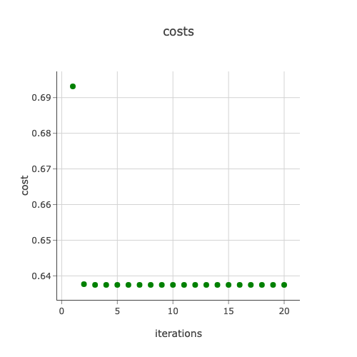

 [](https://github.com/sktan888/Planar_data_classification_with_one_hidden_layer_RUST/actions/workflows/main.yml)

# Planar_data_classification_with_one_hidden_layer_RUST
RUST implementation of one layer neural network for planar data classification.

## Set up working environment
* install RUST and packages: ```curl https://sh.rustup.rs -sSf | sh```
	- restart current shell  ``` . "$HOME/.cargo/env"  ``` in .bashrc file
	- check version ``` rustc --version ```
	- install packages ```cargo add name```
* Makefile for make utility : ``` touch Makefile ```
    - format codes ``` make format ```
    - run lint ``` make lint ```
	- run main.rs ``` cargo run``` or ``` make run```
	- test ``` make test```
	- build release ``` make release```
	- run all ``` make all```
* Github workflows file main.yml
	- specify project directory to run from ``` - name: Run clippy ... working-directory: ./one_hidden_layer_nn ```
* Create new project ```Cargo new project_name``` 
	- show project folder structure ``` tree.```
* Project folders:
   - create tests and plots directory ``` mkdir plots ```
   - rename a file: ```mv oldfilename newfilename```
   - src folder contains source code including main.rs
   - tests folder contains test scripts to assess the correctness of some functions
   - plots folder contains the html files of plots
   - log folder contains logging file info.log
   - model folder contains the weights and bias, y_train_prediction, y_test_prediction
* Running Main.rs in Terminal ```cargo run``` 

## Steps
    - Injest the flower plannar dataset
        - 
        - 
    - Linear regression 
        - 
        - 
	- Implement a 2-class classification neural network with a single hidden layer
    - Use the non-linear tanh activation function for hidden layer
    - Compute the cross entropy loss
    - Implement forward and backward propagation
